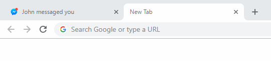

# Don't flash tabs!

It really bugs me how, when you get a message, inactive Facebook and Messenger tab titles start flashing continuously. Super distracting.

So I made a Chrome extension to stop it. The tab title is frozen to the "John messaged you" title until the tab becomes active again.

## Installation

The extension is currently not on the Chrome Web Store because it is so tiny it is probably not worth the $5 to get a developer account, given that I've never heard another human being complain about the flashing tabs. This is a me project, think of it as self care. But if you are also afflicted by finding those flashing tabs irritating, here's how you install it:

* Clone this repository.

* Go to chrome://extensions/

* Turn on developer mode

* Click "Load unpacked" and select the folder you just downloaded

* Enjoy your blissful, relaxed experience free of flashing tab titles

